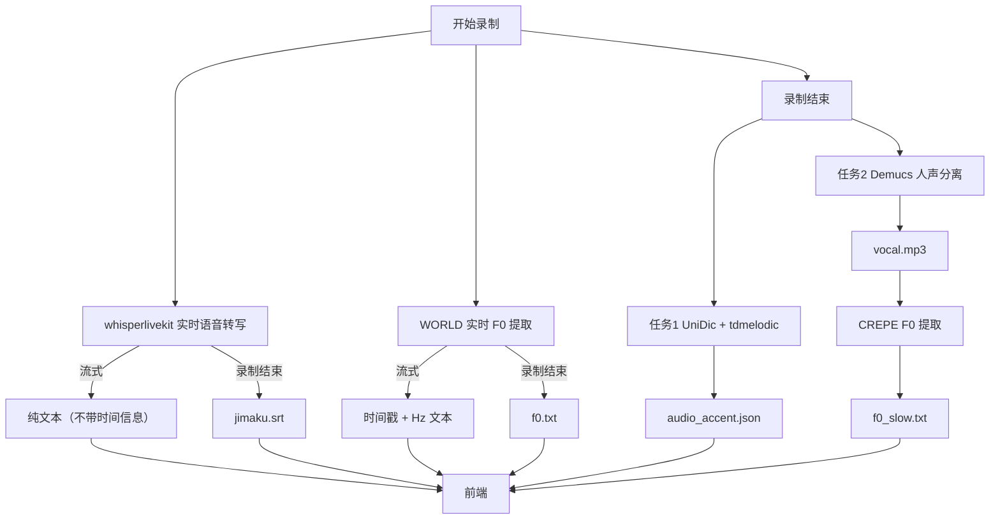

# 分工设计

> 版本：v1.0（由 `分工设计.txt` 结构化改写）
> 更新日期：2026-09-09

关联文档：

- [Utaer项目合作规范及分支说明 (2026.09.05版)](./Utaer项目合作规范及分支说明%20(2026.09.05版).md)
- [技术流程文档与开发细节说明（初期）](./技术流程文档与开发细节说明（初期）.md)
- 项目计划书9月4日第一版.docx

---

## 1. MVP 产品目标

MVP 阶段要打通整条处理链路：

1. **录制时**：实时日语字幕（whisperlivekit）+ 实时 F0 提取（WORLD）；
2. **录制后**：词典声调分析（UniDic + tdmelodic）与人声分离 + 精确 F0 提取（Demucs + CREPE）并行执行；
3. **交付**：各独立功能的产物经 FastAPI 统一转发给前端。

## 2. 开发期文件路径约定（test.env）

项目根目录下有一个 `test.env` 文件（后缀名就是 `env`），内容如下：

```ini
TEST_USER_ID=testuser123
TEST_AUDIO_ID=20030303123749
TEST_SAVE_PATH=fast-api\audio\
```

**使用说明**：本项目涉及多个文件处理流，开发期间暂以 `test.env` 统一约定输出路径——`functions\` 下各独立功能（实时语音字幕、F0 识别、UniDic、Demucs）只需引用项目目录下的 `test.env`，读取 `TEST_USER_ID`、`TEST_AUDIO_ID`、`TEST_SAVE_PATH` 三个值，拼接为如下形式：

```
fast-api\audio\testuser123\20030303123749\
```

即可获得项目开发期间临时的处理后文件保存路径。

> 注：`TEST_AUDIO_ID` 采用「日期 + 6 位随机数」格式（如 `20030303123749`），与《技术流程文档与开发细节说明（初期）》3.2 节中 Supabase Storage 的 `audio/<user-id>/<audio-id>/` 布局约定一致。

后续需要连接上 fast-api 或 supabase 时，只需修改 `TEST_USER_ID`、`TEST_AUDIO_ID`、`TEST_SAVE_PATH` 所在区域的代码即可。

## 3. 项目结构设计

```
Utaer/
├── docs/                    # 后端应生成的信息格式，以及前端应如何处理该信息。
│                            # 流程一经打通就会发布到群里，并更新到远程仓库 main 分支的 docs 文件夹下。
├── fast-api/                # FastAPI 相关代码
│   └── audio/               # 项目开发阶段的测试用文件夹，开发阶段音频处理产生的各种产物都保存在此处
├── functions/               # 各独立功能所在的文件夹
│   ├── crepe/               # CREPE
│   ├── demucs/              # DEMUCS
│   ├── unidic/              # UNIDIC 和 TDMELODIC
│   ├── whisper/             # WHISPERLIVEKIT
│   └── world/               # WORLD
└── test.env                 # 开发期环境变量文件（见第 2 节）
```

## 4. 核心概念：时间戳

时间戳指格式为 `小时(2位数，不足2位则补0):分(同左):秒(同左),毫秒(3位数，不足3位则补0)` 的字符串。

例如：`01:02:03,438`

## 5. MVP 时序设计



### 5.1 录制时

#### 5.1.1 whisperlivekit 实时音频转日语字幕 + 时间轴

- **目标**：流式生成标准字幕 SRT 文件。
- **格式**：

  ```
  [序号，正整数，从1开始]
  [字幕开始时间戳] --> [字幕结束时间戳]
  [字幕内容]

  2
  [字幕开始时间戳] --> [字幕结束时间戳]
  [字幕内容]
  ...
  ```

- **前后端交互方式**：
  - 录制期间：给前端流式传输**不带时间信息的识别纯文本**；
  - 录制结束：生成携带时间信息的 SRT 文件，文件名为 `jimaku.srt`，并传输该文件给前端。
- **可能遇到的技术问题**：制作 SRT 文件需要对字幕内容进行句子划分，这里涉及划分边界的问题；whisperlivekit 是否能实时给出时间信息，需要进一步查询验证。

#### 5.1.2 WORLD 的 F0 提取

- **目标**：流式生成 `时间 + Hz` 信息。
- **精度**：以 ms 为单位，这里设为 `s0`。
- **实现方式**：每隔 `s0` ms 记录一次 F0（单位 Hz）。
- **格式**：

  ```
  [时间戳][空格][Hz的数值]
  [时间戳][空格][Hz的数值]
  ...
  ```

- **前后端交互方式**：
  - 录制期间：给前端流式传输实时的 `[时间戳][空格][Hz的数值]`；
  - 录制结束：生成携带所有时间和 Hz 信息的 txt 文件，文件名为 `f0.txt`，并传输该文件给前端。

> **关于 `f0.txt` 与 `f0_slow.txt`**：
>
> - `f0.txt` 可作为前端展示用户音调时的首选文件；
> - 录制结束后由 CREPE 生成的 `f0_slow.txt` 需要一定时间，前端可在其生成好后再使用其数据；
> - 两者保持**一样的格式**，区别在于前者是实时 + 高效生成结果，后者是后处理 + 精确生成结果。

- **可能遇到的技术问题**：`s0` 是多少？WORLD 能做到实时 + 多少的 `s0`？CREPE 呢？

### 5.2 录制后（两个任务同时进行）

#### 5.2.1 任务 1：UniDic + tdmelodic 生成正确音调

- **目标**：利用 tdmelodic 扩展词典后，每个分词处都有词性（文本）+ 调型（非负整数）。
- **输出格式**：以以下简化版为准，《技术流程文档与开发细节说明（初期）》中「3.3.1 Utaer 声调信息传输规范」的设计**作废**。

```jsonc
{
  "input": "ここに日本語の歌詞または例文を入力",
  "json_data": [
    {
      "idx": 0,                           // 【必填】序号，从0开始
      "morph": "表記形",                  // 【必填】显示用
      "lemma": "辞書形",                  // 【建议保留】查词典用
      "morph_reading": "よみがな",        // 【必填】注音基础
      "pos": "名詞*普通名詞*一般",         // 【可选】词性
      "accent": 0,                       // 【核心】单个数字（0=平板，N=第N拍下降）
      "variants": [0, 3],
      "ruby_pairs": [                    // 【必填】前端构建注音
        ["漢字", "かんじ"]
      ]
    },
    {
      "idx": 1,
      "morph": "やん",
      "lemma": "止む",
      "morph_reading": "やん",
      "pos": "動詞*一般",
      "accent": 0,
      "variants": [0, 3],
      "ruby_pairs": [
        [null, "やん"]
      ]
    }
  ]
}
```

#### 5.2.2 任务 2：Demucs 人声分离 + CREPE F0 提取

**Demucs 分离出人声 + 伴奏**

- **目标**：只取人声音频 `audio.mp3`（格式和改名统一由前端完成），在 `test.env` 所示路径保存为 `vocal.mp3`。

**CREPE 的 F0 提取**

- **目标**：不需要流式传输，直接生成 `f0_slow.txt` 结果即可，格式同 WORLD（见 5.1.2）。

#### 5.2.3 任务完成通知

任务 1 和任务 2 均需要在任务完成后**通知前端**。

## 6. 前端接收内容汇总

| 阶段   | 内容                                       | 载体 / 文件          | 来源                    |
| ------ | ------------------------------------------ | -------------------- | ----------------------- |
| 录制时 | 不带时间信息的识别纯文本                   | 流式文本             | whisperlivekit          |
| 录制时 | 「时间 + Hz」文本                           | 流式文本             | WORLD                   |
| 录制后 | 字幕 SRT 文件                              | `jimaku.srt`         | whisperlivekit          |
| 录制后 | F0 实时提取结果                            | `f0.txt`             | WORLD                   |
| 录制后 | 音调数据                                   | `audio_accent.json`  | UniDic + tdmelodic      |
| 录制后 | F0 后处理精确结果                          | `f0_slow.txt`        | CREPE                   |
| —      | 音频特征（**MVP 阶段暂时不做或看情况做**） | `audio_feature.json` | 后端 feature_analysis   |

## 7. 开发规范

1. **启动脚本命名**：所有独立功能的启动脚本统一命名为 `init.py`：

   ```
   functions\crepe\init.py    # CREPE
   functions\demucs\init.py   # DEMUCS
   functions\unidic\init.py   # UNIDIC 和 TDMELODIC
   functions\whisper\init.py  # WHISPERLIVEKIT
   functions\world\init.py    # WORLD
   ```

2. **保存路径**：开发阶段，文件的保存路径只需引用项目目录下的 `test.env`，读取 `TEST_USER_ID`、`TEST_AUDIO_ID`、`TEST_SAVE_PATH` 内容，拼接为类似 `fast-api\audio\testuser123\20030303123749\` 的形式，即可获得项目开发期间临时的处理后文件保存路径。后续需要连接上 fast-api 或 supabase 时，只需修改 `TEST_USER_ID`、`TEST_AUDIO_ID`、`TEST_SAVE_PATH` 所在区域的代码即可。

## 8. 待解决问题

1. 有流式信息的独立功能，**如何向 FastAPI 传递文本信息**？
2. 无流式信息的独立功能，**如何向 FastAPI 传递完成状态信息**？（曾设计过基于 Supabase 的 `pending`、`completed`、`failed` 三态，详见《技术流程文档与开发细节说明（初期）》3.2 节）

## 9. FastAPI 所承担的角色

接受前端信息，并向前端发消息 / 文件。

## 10. 分工

| 成员         | 负责模块                     | 说明                                       |
| ------------ | ---------------------------- | ------------------------------------------ |
| Lin          | UniDic + World + Crepe       | 词典声调提取 + F0 提取一起做，信息协同处理更方便 |
| He           | Demucs                       | 人声分离                                   |
| Liu          | 前端                         | —                                          |
| Li / Wang    | whisperlivekit               | 实时语音转写                               |
| Wang         | FastAPI（前期）→ Supabase（后期） | 接受前端信息并向前端发消息 / 文件           |

> 成员暂以姓氏 / 代号区分。技术栈负责人的 GitHub 用户名（暂定）见《Utaer项目合作规范及分支说明 (2026.09.05版)》第 0 节。

## 11. 未尽事项与分支设计

### 11.1 未尽事项

- frontend 的 force push 问题；
- main 的分支权限问题：
  - 本项目的各类文档（API 接口文档、项目计划书等）均会在 `main` 分支 `docs` 文件夹下更新；
  - **主干保护**：`main` 和 `dev` 分支设置为 **“禁止直接推送 (Protected)”**，必须通过 PR 并经过 owner 审查才能合入；
  - **合并方式**：统一采用 `Merge Commit`。
  - （详见《Utaer项目合作规范及分支说明 (2026.09.05版)》第 4 节）

### 11.2 分支设计变更

**GitHub 上分支的原设计**：

```
main, dev, unidic, frontend, backend, (worker)
```

**新设计**：

```
main
└── dev
    ├── unidic_and_f0    # UniDic + World + Crepe
    ├── demucs           # Demucs
    └── whisperlivekit   # whisperlivekit
```

即：由 `main` 分支出 `dev`，由 `dev` 分支出 `unidic_and_f0`、`demucs`、`whisperlivekit` 三个独立功能分支。

**此设计下，前端与 FastAPI 的工作通过 PR 提交到 `dev` 分支。**
